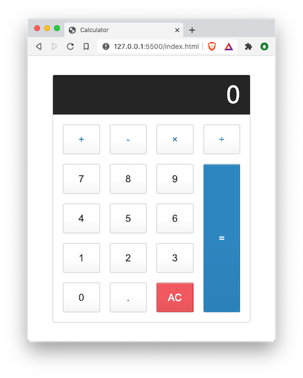
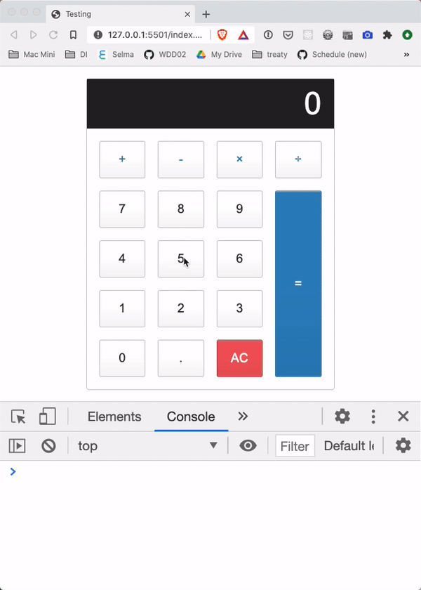

# 01 Exercise - JavaScript Calculator and functions

## Brief

Currently, the calculator does not work as expected because it is missing the add, subtract, multiply and divide functions.

You need to complete these functions to get the calculator working.



## Rationale

Practice writing functions, and refactoring exiting functions to use arrow functions

## Instructions Part A - Convert existing functions to arrow functions

The existing JavaScript has a lot of functions declared using the `function` keyword. As good JavaScript developers, we like our JavaScript style to be consistent.

Convert the existing functions to use arrow functions. If you need help, reference the [The different ways to write functions](https://www.loom.com/share/211cd1a14d5c4246a71c1d23059c9ef6) tutorial.

You do not need to understand the JavaScript inside the functions, but you should be able to convert the style of functions to an arrow function.

**Acceptance criteria**

- Every function in `script.js` is using the arrow function syntax


## Instructions Part B - Complete the missing functions

1. Open up your browser console and use the calculator. You should notice some errors appearing, stating that some functions are not declared

   

2. Create a function named `add`. Ensure you use the arrow function syntax. It should meet the following requirements:

   ```
   Inputs: number 1, number 2
   Processes: Add the numbers together
   Output: The result of the addition

   Example:
   Input 1: 2
   Input 2: 3
   Output: 5
   ```

3. Create a function named `subtract`. It should meet the following requirements:

   ```
   Inputs: number 1, number 2
   Processes: Subtract number 1 from number 2
   Output: The result of the subtraction

   Example:
   Input 1: 5
   Input 2: 3
   Output: 2

   Example:
   Input 1: -5
   Input 2: 3
   Output: -8
   ```

4. Create a function named `multiply`. It should meet the following requirements:

   ```
   Inputs: number 1, number 2
   Processes: Multiply the numbers together
   Output: The result of the multiplication

   Example:
   Input 1: 2
   Input 2: 3
   Output: 6
   ```

5. Create a function named `divide`. It should meet the following requirements:

   ```
   Inputs: number 1, number 2
   Processes: Divide number 1 by number 2
   Output: The result of the division

   Example:
   Input 1: 8
   Input 2: 2
   Output: 4
   ```

**Acceptance criteria**

- `add`, `subtract`, `multiply` and `divide` functions are implemented
- The calculator works as expected with no errors in the console

---

# Submit your Exercise

- [ ] Commits are pushed to GitHub
- [ ] Automated tests pass on GitHub

---

## Exercise answer walkthrough

- [JavaScript Calculator exercise walkthrough](https://www.loom.com/share/0a32faf54665492fb6bde0463bdbdec6)